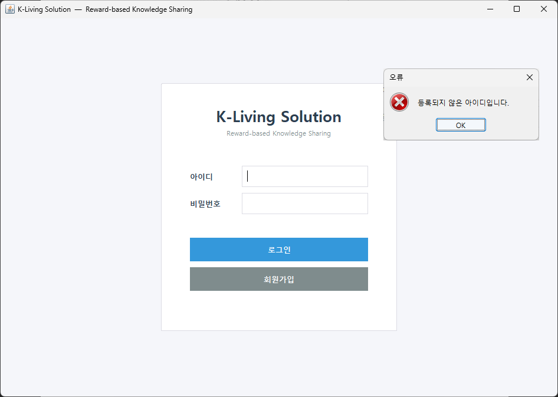
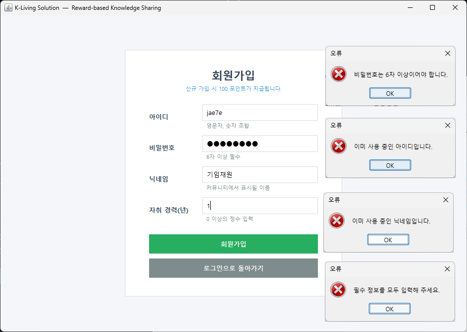

# 4. User Interface Prototype

## 4.1 Login

위 이미지는 K-Living Solution에서 로그인하는 상황에서의 UI들이다. 

일반 사용자, 시스템 관리자들은 각각 본인의 계정으로 로그인할 수 있다. 

로그인과정에서 등록되지 않은 회원이 로그인을 시도할 시, 아이디, 비밀번호를 비웠을 때의 팝업창을 볼 수 있다.

## 4.2 Registration

위 이미지는 회원가입 상황에서의 UI들이다.

회원가입하려는 사용자는 요구하는 정보들을 입력해야 한다.

회원가입이 실패하는 예외 상황들에 맞는 메시지와 팝업창을 볼 수 있다.

회원가입 시 포인트가 100P 지급되고 이는 현재, 누적 포인트에 바로 반영된다.

## 4.3 User Main Screen

위 이미지는 일반 사용자가 회원가입 후 로그인 했을때 볼 수 있는 UI들이다.

일반 사용자는 메인 화면에서 자신의 등급, 포인트 관련 정보를 확인할 수 있다.

또한 질문 목록 보기, 질문 등록하기, 내 프로필, 로그아웃 기능을 제공한다.

## 4.4 Question List

위 이미지는 일반 사용자 메인 화면에서 질문 목록 보기 버튼을 눌러 이동할 수 있다.

질문이 등록된 순서에 따라 번호를 순차적으로 부여받는다.

질문 등록시 선택한 카테고리와 함께 제목, 작성자, 포인트 보상이 표시된다.

상태 칸에는 답변 모집 중인 질문은 진행중, 채택된 답변은 채택완료로 표시된다.

질문 선택 후 마우스 더블 클릭 혹은 선택 게시글 보기 버튼을 눌러 질문을 확인할 수 있다.

질문 등록은 메인 화면 질문 등록하기에서 할 수도 있지만, 

질문 목록 보기 창에서도 질문 등록 버튼을 눌러 질문할 수 있다.

컬럼 칸보다 텍스트가 길어 짤리는 경우를 고려해 컬럼의 길이를 사용자가 조절할 수 있다.

## 4.5 Question & Answer Information

위 이미지는 등록된 질문을 더블 클릭 혹은 선택 게시글 보기를 눌러 들어온 화면이다.

등록된 질문의 정보들을 알려준다. 

답변이 얼마나 달렸는지와 등록된 답변의 내용을 확인할 수 있다.

작성자 본인은 답변을 달 수 없으며 본인의 질문은 채택할 수 없다.

작성자 외의 사용자는 위 이미지와 같이 답변을 등록할 수 있다.

작성자는 등록된 답변을 위 이미지와 같이 채택할 수 있다.

답변 채택을 하면 보상만큼의 포인트가 채택된 사용자에게 예치된다.

## 4.5 User Profile

위 이미지는 사용자의 자취 연차, 등급, 현재 포인트, 누적 포인트, 등록한 질문/답변의 개수를 보여준다.

일반 사용자 메인 화면에서 내 프로필 버튼을 눌러 이동할 수 있다.

## 4.6 Logout

위의 이미지는 일반 사용자 메인 화면에서 로그아웃 버튼을 눌렀을 때 표시되는 팝업창이다.

## 4.7 Admin Main Screen

위 이미지는 로그인 화면에서 관리자 아이디와 비밀번호 입력하면 나오는 UI들이다.

관리자는 질문을 등록할 수 없다. 

## 4.8 Admin Page

위의 이미지는 관리자 메인화면에서 관리자 페이지를 눌러 이동한 화면이다.

이 화면에선 사용자의 수와 질문, 포인트와 관련된 통계를 확인할 수 있다.

새로고침을 통해 실시간 반영이 가능하다.

위의 이미지는 사용자들의 정보를 확인할 수 있는 창이다.

관리자는 일반 사용자를 차단/ 차단 해제할 수 있는 권한이 있다.

위의 이미지는 사용자들의 정보를 확인할 수 있는 창이다.

관리자는 질문 게시글을 삭제할 수 있는 권한이 있다.

